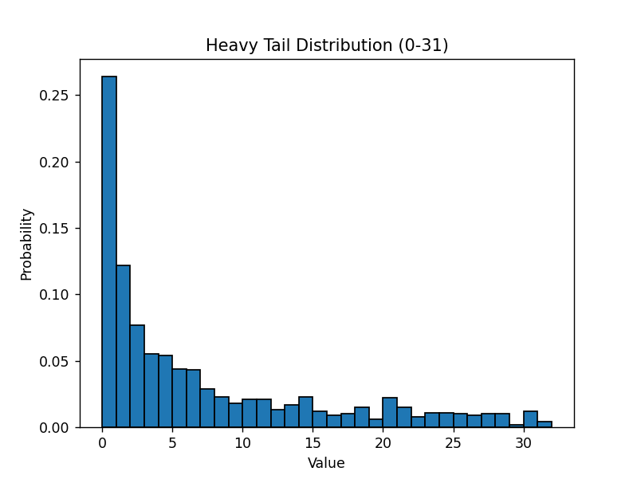
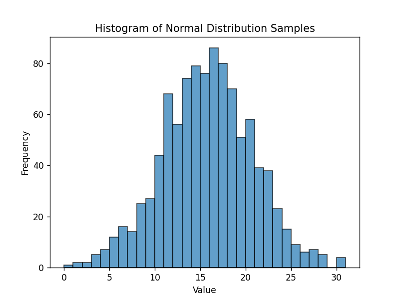
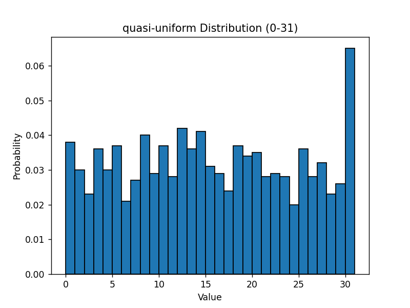
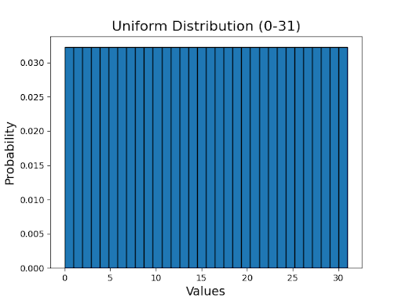
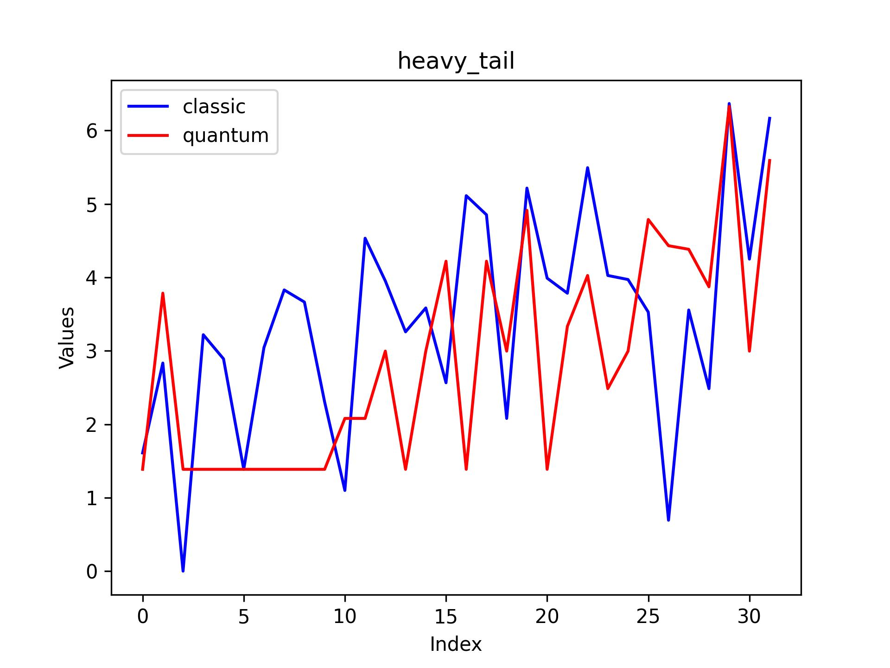
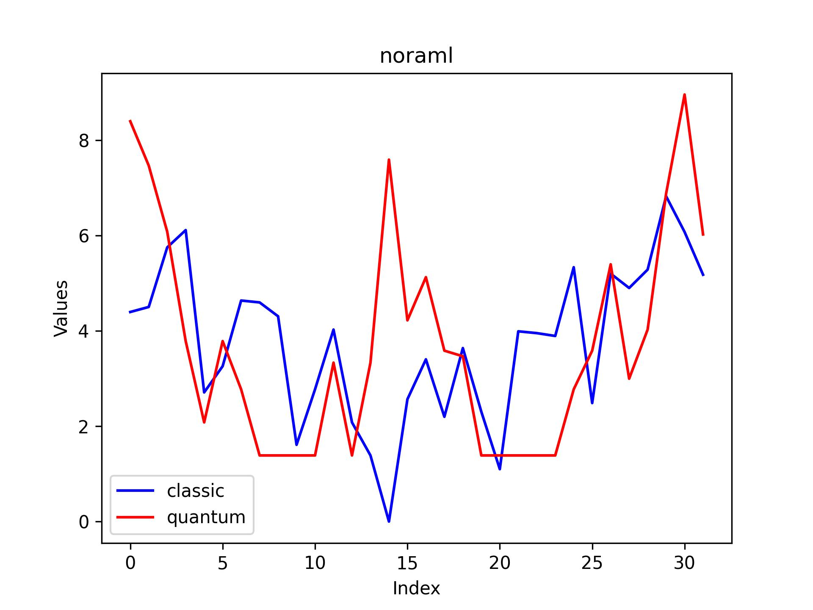
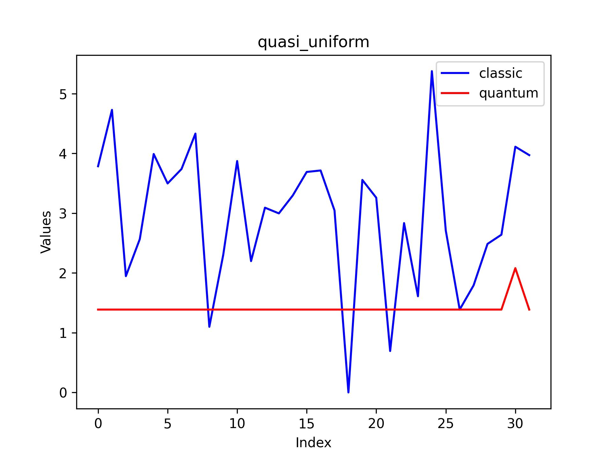
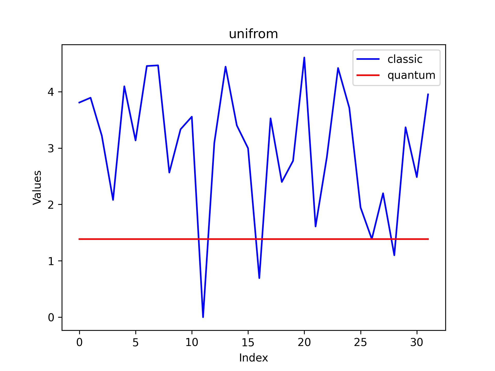

# Adaptive-grover-algorithm for weighted data search

This project implements adaptive-grover-algorithm using Qiskit, analyzing differet dataset distributions and producing visualization results. 

Special thanks to Yifan Sun and Lian-Ao Wu for "[Quantum search algorithm on weighted databases](https://doi.org/10.1038/s41598-024-81701-7)", which has been a helpful reference and an informative read

## Installation

### Prerequisites
- Python 3.7 or later
- pip or conda package manager

### Installing Qiskit
Follow these steps to install Qiskit and required dependencies:

```bash
# Create and activate virtual environment (recommended)
python -m venv venv
source venv/bin/activate  # On Windows use: venv\Scripts\activate

# Install Qiskit and dependencies
pip install qiskit
```

For detailed installation instructions and troubleshooting, refer to the [Official Qiskit Installation Guide](https://qiskit.org/documentation/getting_started.html).

## Data Description

The project uses quantum state measurement data located in the `data/` directory. The dataset includes:

```
data/
├── heavy_tail_samples.txt       
├── normal_distribution_samples.txt
├── normal_distribution_samples.txt
├── quasi_uniform_samples.txt
└── uniform_distribution.txt  
```

Example distribution from our dataset:






The distribution graph shows the probability distribution of datasets.

## Running the Analysis

1. Clone the repository:
```bash
git clone git@github.com:griefinglol/adaptive_grover.git
```

2. Prepare your environment (see Installation section)

3. Run the data_process.py, do classical linear search on each database:
```bash
python3 data_process.py
```

4. Run the quantum_step.py, do adaptive grover search on each database:
```bash
python3 quantum_step.py
```

5. Run the script `compare.py` to analyze and compare the number of steps required to locate each piece of data using classical versus quantum approaches:
```bash
python3 compare.py
```


## Results

The analysis results are saved in the `output/` directory:

```
output/
├── heavy_tail.jpg     
├── noraml.jpg   
├── quasi_uniform.jpg   
└── unifrom.jpg 
```

Example visualization of results:






## final paper

Will come soon
